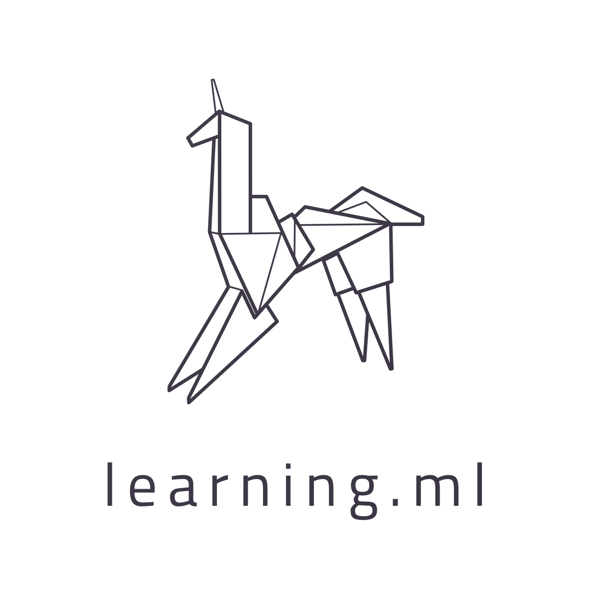

# Learning ML

A practical guide to understanding and applying machine learning algorithms in the quest to become a 🦄.

by **[@blairhudson](http://twitter.com/blairhudson)**

## Table of Contents

### [1. Introduction](01.00-Introduction.ipynb)
* [1.01 WTF](01.01-WTF.ipynb)
* [1.02 Getting Started](01.02-Getting-Started.ipynb)

### [2. Classification](02.00-Classification.ipynb)
* [2.01 Starting Simple](02.01-Starting-Simple.ipynb)

### [3. Regression](03.00-Regression.ipynb)

### [4. Data Preparation](04.00-Data-Preparation.ipynb)

This work is licensed under [CC BY-NC-ND 3.0 AU](https://creativecommons.org/licenses/by-nc-nd/3.0/au/).
